	
				**愿景："让编程不再难学，让技术与生活更加有趣"**

**更多课程请访问 xdclass.net**

### 第一章 React全家桶入门到项目实战课程介绍

#### 第1集 React全家桶课程介绍+适合人员+学后水平

**简介：课程介绍、适合人员和学后水平**

- 适合人群

  - 前端工程师

  - 后端工程师

  - 测开工程师

     

- 岗位需求

   

   

- 学后水平

  - 全方位讲解React全家桶：脚手架、路由、Redux的理解和使用
  - 掌握React常用的Hooks、生命周期、类和函数式组件
  - 详解虚拟Dom、Diff算法、列表渲染key值
  - 掌握第三方组件库Ant-Design、样式框架Unocss的配置使用
  - 使用React函数式组件、状态管理zustand、网络请求useFetch开发项目

   

- 项目实战演示

   

- 学习形式

  - 视频讲解+文字笔记+代码分析+交互流程图
  - 配套源码 + 笔记 + 课程软件 + 技术交流群 + 答疑
  - 		


#### 第2集 课程章集目录速览

**简介：课程章集目录速览**

- 课程章集目录速览


#### 第3集 走进React的世界和Vue较短比长

**简介：走进React的世界和Vue较短比长**

- react是什么

  - 用于构建 Web 和原生交互界面的库

  - 由FaceBook开发和开源免费的Web框架

    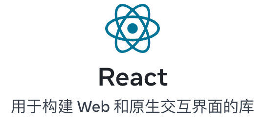

  - 官网
    - 英文官网:[ https://reactjs.org/](https://reactjs.org/)
    -  中文官网: https://react.docschina.org/

  - 理解
    - 操作DOM将数据渲染成页面

  - 为什么要用？

    - 原生JS开发会涉及到频繁操作DOM性能低

    - 直接操作DOM导致浏览器大量的重绘重排

    - 原生JS没有组件化的特性，项目的代码杂乱、复用率低、难维护

    - React Native开发混合APP（android+ios）使用的是react语法

      

- react和vue的较短比长

  - react
    - 更灵活的组件化
      - React 的组件开发模式更加灵活，可组合性更强，可以将应用程序拆分为更小的组件，实现复用和解耦，提高应用程序的可维护性。
    - 更高的性能和优化
      - React 使用虚拟 DOM 技术，可以在不影响页面性能的情况下进行组件状态更新，提高了应用程序的性能和响应速度。
    - 更偏向于函数式编程
      - React 更偏向函数式编程，拥有更好的代码复用性和可测试性，可以避免常见的副作用和数据改变问题。

  

  - vue
    - 更易使用和理解
      - Vue API 实现和许多插件都相当简单易用，这使得开发者可以快速上手，文档的可读性确保了开发者可以精准理解其用法。
    - 更加高效的模板技术
      - Vue 借助其渐进式框架的特性，提供了更灵活、更高效的模板技术，可以轻松创建包含大量组件的应用程序。
    - 更好的响应式能力
      - Vue 的响应式系统可以跟踪状态并将变更驱动到组件，如果修改了任何状态，组件将自动重新渲染，并自动更新应用程序的状态。

  

  - 总结
    - React 更适用于大规模的应用程序开发，拥有更高的性能和灵活性，更偏向于函数式编程
    - Vue 更适用于中小型应用程序的开发，易上手并提供了完整的、高效的模板技术和响应式系统
    - 两者之间的选择很大程度上取决于个人或团队对不同框架的经验和应用场景

  

  ​	

	
				**愿景："让编程不再难学，让技术与生活更加有趣"**

**更多课程请访问 xdclass.net**

### 第二章 React的基本使用开发

#### 第1集 用React写第一个helloword

**简介：用React写第一个helloword**

- 注意：通过cdn地址引入方式学习react的基本语法使用，生产环境是需要通过react脚手架开发

- 通过cdn地址引入react使用

  ```html
  <!DOCTYPE html>
  <html lang="en">
    <head>
      <meta charset="UTF-8" />
      <meta http-equiv="X-UA-Compatible" content="IE=edge" />
      <meta name="viewport" content="width=device-width, initial-scale=1.0" />
      <title>Document</title>
    </head>
    <body>
      <div id="root"></div>
      <!-- 引入react的核心库 -->
      <script
        crossorigin
        src="https://unpkg.com/react@18.2/umd/react.development.js"
      ></script>
      <!-- 引入react-dom用于支持react操作dom -->
      <script
        crossorigin
        src="https://unpkg.com/react-dom@18.2/umd/react-dom.development.js"
      ></script>
      <!-- 引入babel转换jsx为js -->
      <script src="https://unpkg.com/@babel/standalone/babel.min.js"></script>
      <script>
        // 1.创建虚拟dom
        const vdom = React.createElement("div", {}, "hello react")
        // 2.找到容器，将虚拟dom渲染到页面中
        const root = ReactDOM.createRoot(document.getElementById("root"));
        root.render(vdom);
      </script>
    </body>
  </html>
  
  ```

  - 使用JSX

  ```jsx
  <script type="text/babel"> 
   	// 1.创建虚拟dom
    const vdom = <div>hello react</div>;
    // 2.找到容器，将虚拟dom渲染到页面中
    const root = ReactDOM.createRoot(document.getElementById("root"));
    root.render(vdom);
  </script>
  ```

  - react开发工具
    - 每个框架都会有自己的开发者工具
  - babel警告
    - 不是标准的用法，代码复杂时页面渲染白屏

- react@18版本之前旧版的写法

  ```jsx
  <script type="text/babel">
    // 1.创建虚拟dom
    const vdom = <div>hello react</div>;
    // 2.找到容器，将虚拟dom渲染到页面中
    ReactDOM.render(vdom，document.getElementById("root"));
  </script>
  ```


#### 第2集 怎么理解虚拟DOM和真实DOM？

**简介：怎么理解虚拟DOM和真实DOM？？**

- 虚拟DOM
  - 是一般的js对象
  - 虚拟DOM属性较少，只满足react使用的属性和方法
  - 最后会被react转成真实DOM


- 真实DOM
  - 在浏览器中被转换成标签
  - 里面的属性和方法非常多，提供开发者调用


#### 第3集 React为什么要使用JSX？

**简介：React为什么要使用JSX？**

- 定义

  - 全称 JavaScript XML，是一种嵌入式的类似XML的语法扩展

    ```
    XML是用于储存和传输数据，例如微信登录
    现在普遍使用JSON储存和传输
    ```

    


- React为什么要使用JSX

  - 创建 <div>hello word</div> 的虚拟dom

    - js方式

      ```js
      const vdom = React.createElement("div", {}, "hello react")
      ```

      

    - jsx方式

      ```jsx
      const vdom = <div>hello react</div>;
      ```

      

    

  - 创建 <div> <h1>hello word</h1> </div> 的虚拟dom

    - js方式

      ```js
      const vdom = React.createElement("div", {}, React.createElement("h1",{},"hello react"))
      ```

    

    - jsx方式

      ```jsx
      const vdom = (
        <div>
          <h1>hello react</h1>
        </div>
      );
      ```

      

  - 总结
    - jsx是js创建虚拟dom的语法糖，提高开发效率


#### 第4集 深入理解React的JSX和上手开发

**简介：深入理解React的JSX和上手开发**

- JSX练习

  ```html
  <!DOCTYPE html>
  <html lang="en">
    <head>
      <meta charset="UTF-8" />
      <meta http-equiv="X-UA-Compatible" content="IE=edge" />
      <meta name="viewport" content="width=device-width, initial-scale=1.0" />
      <title>Document</title>
      <style>
        .title {
          color: red;
        }
      </style>
    </head>
    <body>
      <div id="root"></div>
      <!-- 引入react的核心库 -->
      <script
        crossorigin
        src="https://unpkg.com/react@18.2/umd/react.development.js"
      ></script>
      <!-- 引入react-dom用于支持react操作dom -->
      <script
        crossorigin
        src="https://unpkg.com/react-dom@18.2/umd/react-dom.development.js"
      ></script>
      <!-- 引入babel转换js为jsx -->
      <script src="https://unpkg.com/@babel/standalone/babel.min.js"></script>
      <script type="text/babel">
        const xd = "xdclass";
        const text = "小滴课堂";
        // 1.创建虚拟dom
        const vdom = (
          <>
            <div id={xd} className="title">
              <h1 style={{ color: "blue", fontSize: "30px" }}>{text}</h1>
            </div>
            <div>学习react课程</div>
          </>
        );
        // 2.找到容器，将虚拟dom渲染到页面中
        const root = ReactDOM.createRoot(document.getElementById("root"));
        root.render(vdom);
      </script>
    </body>
  </html>
  ```

  

- JSX练习总结
  - 定义虚拟dom时不加字符串引号
  - 标签中引入变量或者js表达式要使用{}
  - 样式的类名使用className
  - 内联样式要使用style={{key:value}}
  - 只能有一个根标签，所有标签必须闭合
  - 标签如果是小写字母则代表使用html标签，大写则是自定义的组件，都没有找到会报错


#### 第5集 React的JSX如何动态渲染数据？

**简介：React的JSX如何动态渲染数据？**

- JSX代码练习

  ```html
  <!DOCTYPE html>
  <html lang="en">
    <head>
      <meta charset="UTF-8" />
      <meta http-equiv="X-UA-Compatible" content="IE=edge" />
      <meta name="viewport" content="width=device-width, initial-scale=1.0" />
      <title>Document</title>
      </style>
    </head>
    <body>
      <div id="root"></div>
      <!-- 引入react的核心库 -->
      <script
        crossorigin
        src="https://unpkg.com/react@18.2/umd/react.development.js"
      ></script>
      <!-- 引入react-dom用于支持react操作dom -->
      <script
        crossorigin
        src="https://unpkg.com/react-dom@18.2/umd/react-dom.development.js"
      ></script>
      <!-- 引入babel转换js为jsx -->
      <script src="https://unpkg.com/@babel/standalone/babel.min.js"></script>
      <script type="text/babel">
        const personList = ["老王", "冰冰", "anna", "小D", "大钊"];
  
        // 1.创建虚拟dom
        const vdom = (
          <>
            <h1>人员列表</h1>
            <ul>
              {personList.map((i, index) => {
               return  <li key={index}>{i}</li>;
              })}
            </ul>
          </>
        );
        // 2.找到容器，将虚拟dom渲染到页面中
        const root = ReactDOM.createRoot(document.getElementById("root"));
        root.render(vdom);
      </script>
    </body>
  </html>
  ```

- 通过原生DOM渲染

  ```html
  <!DOCTYPE html>
  <html lang="en">
    <head>
      <meta charset="UTF-8" />
      <meta http-equiv="X-UA-Compatible" content="IE=edge" />
      <meta name="viewport" content="width=device-width, initial-scale=1.0" />
      <title>Document</title>
    </head>
    <body>
      <div id="root">
        <h1>人员列表</h1>
        <ul></ul>
      </div>
  
      <script>
        const person = ["老王", "冰冰", "anna", "小D", "大钊"];
        let str = "";
        person.forEach((i) => {
          str += `<li>${i}</li>`;
        });
        let ul = document.getElementsByTagName("ul")[0];
        ul.innerHTML = str;
      </script>
    </body>
  </html>
  
  ```

  


#### 第6集 认识模块化和组件化编程

**简介：认识模块化和组件化编程**

- 模块化

  - 一般指一个 `js` 文件，提取公共或逻辑复杂的 `js` 代码


  - 复用 `js` 代码、提高代码的复用率


  - 当项目中的 `js` 都用模块来编写，那这个项目就是模块化的

    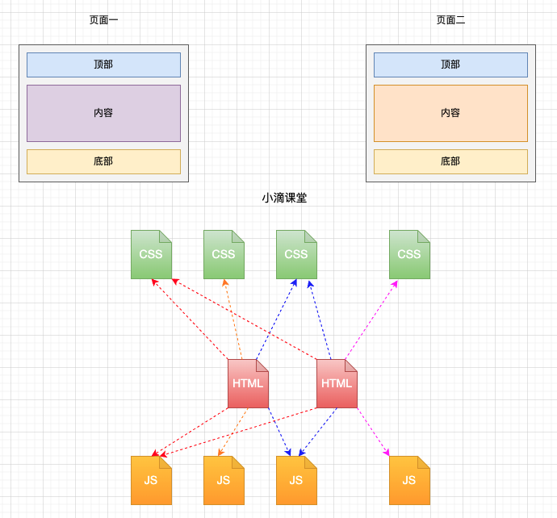

- 组件化

  - 实现局部功能、逻辑的代码合集（html、css、js、image、map4）

    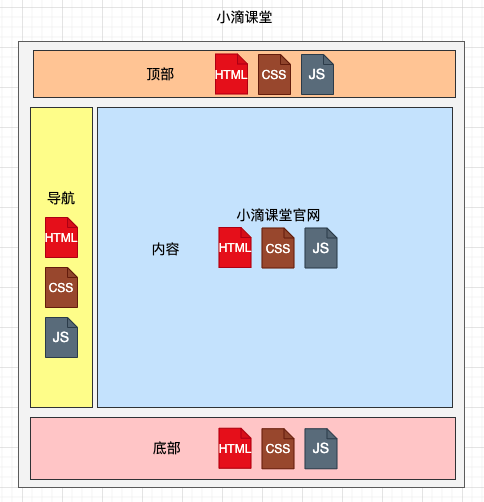


	
				**愿景："让编程不再难学，让技术与生活更加有趣"**

**更多课程请访问 xdclass.net**

### 第三章 React脚手架搭建和组件开发

#### 第1集 初始化创建React脚手架

**简介：初始化创建React脚手架**

- 安装node环境

  - https://www.runoob.com/nodejs/nodejs-install-setup.html

- 使用 vite 创建一个 react 项目

  - vite官网

    - https://cn.vitejs.dev/

  - 安装vite

    ```
    yarn create vite
    
    1. 执行 y 同意
    2. 输入项目名，回车
    3. 键盘选择react，回车
    4. 键盘选择JavaScript
    ```

  - 使用yarn包管理工具下载依赖

    ```
    yarn 
    ```

    - yarn和npm包管理工具一样都可以下载插件或依赖，使用方式差不多

    - 下载依赖

      - yarn

      - npm i

        

    - 运行项目

      - yarn dev

      - npm run dev

        

    - 下载插件

      - yarn add axios

      - yarn global add axios（全局）

      - npm i axios

      - npm install -g axios（全局）

        

    - 卸载插件

      - yarn  remove axios
      - npm uninstall axios

      

  - 运行项目

    ```
    yarn dev
    ```

    


#### 第2集 分析React脚手架项目结构信息

**简介：分析React脚手架项目结构信息**

- 项目的文件结构

- 

  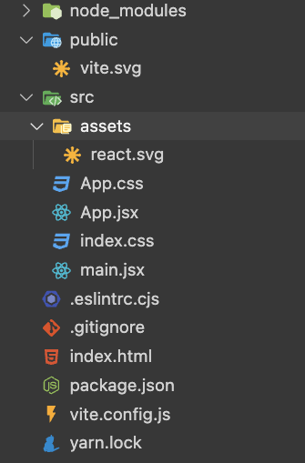

  
  
  ```js
  node_modules   ——放置项目的依赖文件
  
  public         ——静态资源文件夹
  
  src            ——放置开发的代码文件
  
  assets         ——项目中的图片资源
  
  app.jsx        ——页面入口文件
  
  main.jsx       ——程序入口文件
   
  eslintrc.cjs   ——eslint 的配置文件，通常用于设置代码风格规范、语法检查和其他的代码Lint检查
  
  .gitignore     ——git忽略文件
  
  index.html     ——项目总的入口文件
  
  package.json   ——项目依赖的描述文件
  
  vite.config.ts ——编译工具vite的配置文件
  
  yarn.lock  		 ——锁定项目的依赖包版本	
  ```
  
  ```
  //main.jsx
  
  <React.StrictMode/>  ——开启严格模式，和js中的严格模式不同
  
  1.识别不安全的生命周期组件
  2.有关旧式字符串ref用法的警告
  3.关于一些被弃用的方法的警告，比如（findDOMNode）
  4.检测意外的副作用
  5.检测过时的API
  ```
  
  


#### 第3集 函数式组件和类式组件开发

**简介：函数式组件和类式组件开发**

- React官网已经都是函数式组件文档，没有类组件文档，但是还是支持这种写法

- 入口文件

  ```jsx
  ReactDOM.createRoot(document.getElementById('root')).render(
    <React.StrictMode>
      <App />
    </React.StrictMode>,
  )
  
  ReactDOM.createRoot：调用createRoot以创建用于在浏览器 DOM 元素内显示内容的 React 根
  ```

  

- 函数式组件

  - 定义组件最简单的方式就是编写 JavaScript 函数

  - 它接收唯一带有数据的 “props”（代表属性）对象与并返回一个 React 元素。这类组件被称为“函数组件”，因为它本质上就是 JavaScript 函数

    ```jsx
    function App(props) {
      return (
        <div>小滴课堂{props.name}课程</div>
      )
    }
    
    export default App
    
    函数名称首字母大写
    ```

    

  

- 类组件

  - 使用  ES6的class 来定义组件，和上面的函数组件是一模一样的

  - 在最新 react 版本官网文档已经几乎没有 class 内容，但是很多公司的项目还是旧版本 react 维护的，需要认真学习

    ```jsx
    import React from 'react'
    
    class App extends React.Component{
      render(){
        return (
          <div>小滴课堂{this.props.name}课程</div>
        )
      }
    }
    
    export default App
    ```

    


- 旧版的react文档
  - https://zh-hans.legacy.reactjs.org/


#### 第4集 初入茅庐—React组件化开发练习

**简介：React组件化开发练习**

- 渲染组件

  - 当用户自定义组件时，它会将 JSX 所接收的属性（attributes）以及子组件（children）转换为单个对象传递给组件，这个对象被称之为 “props”。

    ```jsx
    class App extends React.Component{
      render(){
        return (
          <div>小滴课堂{this.props.text}课程</div>
        )
      }
    }
    ```

  - 发生了什么

    - 调用 `root.render()` 函数，并传入 `<App text="react"/>` 作为参数。
    - React 调用 `App` 组件，并将 `{text: 'react'}` 作为 props 传入。
    - `App` 组件将 `<div>小滴课堂react课程</div>` 元素作为返回值。
    - React DOM 将 DOM 高效地更新为 `<div>小滴课堂react课程</div>`。


- 注意

  ```
  自定义组件名称必须以大写字母开头。
  React 会将以小写字母开头的组件视为原生 DOM 标签
  例如，<div /> 代表 HTML 的 div 标签，而 <App /> 则代表一个组件，并且需在作用域内使用 App。
  ```

  


- 嵌套组件

  ```jsx
  import React from "react";
  
  class Children extends React.Component {
    render() {
      return <div>正在学习的课程</div>;
    }
  }
  
  class App extends React.Component {
    render() {
      return (
        <>
          <Children />
          <div>小滴课堂{this.props.text}课程</div>
        </>
      );
    }
  }
  
  export default App;
  
  ```

  - 所有 React 组件都必须像纯函数一样保护它们的 props 不被更改

    ```js
    function sum(a, b) {
      return a + b;
    }
    
    props的修改
    function withdraw(account, amount) {
      account.total += amount;
    }
    ```
    
    


	
				**愿景："让编程不再难学，让技术与生活更加有趣"**

**更多课程请访问 xdclass.net**

### 第四章 React的核心属性和生命周期

#### 第1集 React组件的核心属性—state

**简介：React组件的核心属性—state**

- state	
  - 组件的状态，State 与 props 类似，但是 state 是私有的，并且完全受控于当前组件


- 练习

  ```react
  import React from "react";
  
  class App extends React.Component {
    constructor(props) {
      super(props);
      // 初始化状态
      this.state = { isWash: true };
    }
    render() {
      return (
        // 读取状态
        <div>
          老王今天{this.state.isWash ? "去" : "没有去"}洗脚了
        </div>
      );
    }
  }
  
  export default App;
  ```

  

  


#### 第2集 React组件的核心属性—事件处理

**简介：React组件的核心属性—事件处理**

- 事件的绑定和改变状态

  - handleClick 放在类 App 的原型对象上，供实例使用，在 render() 中调用时必须加 this

    ```jsx
    import React from "react";
    
    class App extends React.Component {
      constructor(props) {
        super(props);
        this.state = { isWash: true };
      }
      render() {
        return (
          <div onClick={this.handleClick}>
            老王今天{this.state.isWash ? "去" : "没有去"}洗脚了
          </div>
        );
      }
     	handleClick() {
        console.log(点击了)
      }
    }
    
    export default App;
    
    ```

  - 改变构造函数中的状态state

    ```jsx
    this.handleClick = this.handleClick.bind(this)
    ```

    

  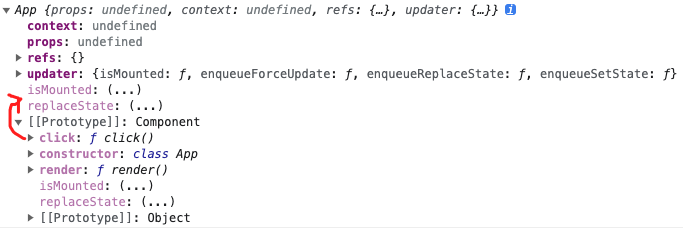

  

  - handleClick 要访问构造器的 state 就必须要改变 this 指向实例 

    - handleClick 并不是通过实例调用的

    - 类中的方法默认都开启了局部的严格模式，所以 handleClick this 为 undefined

      ```
      类似：
      const a = new App();
      const r = a.click;
      r();
      ```

      


#### 第3集 定义state和事件处理的简写方式

**简介：定义state和事件处理的简写方式**

- 简写state

  - 在类中不写构造器直接增加一个state的对象属性

  - 将普通函数换成箭头函数的写法

    ```jsx
    import React from "react";
    class App extends React.Component {
      state = { isWash: false };
      render() {
        return (
          <div onClick={this.handleClick}>
            老王今天{this.state.isWash ? "去" : "没去"}洗脚了
          </div>
        );
      }
      handleClick = () => {
        this.setState({ isWash: !this.state.isWash });
      };
    }
    export default App;
    ```

    

  


#### 第4集 深入理解React的生命周期（旧）—挂载阶段

**简介：深入理解React的生命周期（旧）**

- React17版本之前的生命周期函数（旧）

  

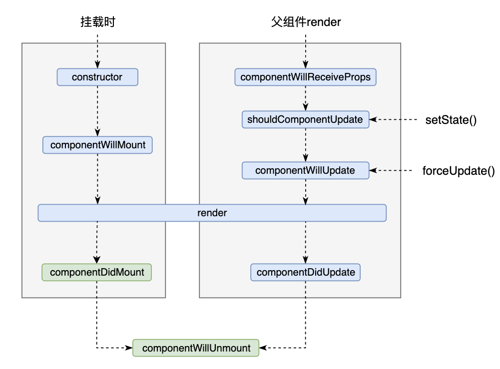

- 三个阶段

  - 挂载阶段

    - constructor ->componentWillMount->render->componentDidMount

      ```
      constructor：这是一个构造器，接收父组件的props和初始化state值
      
      componentWillMount：组件将要挂载，在render之前执行这个函数，用的比较少
      
      render：常用且重要的钩子函数之一，render将标签渲染在浏览器显示页面内容
      
      componentDidMount：render执行完，可以操作dom，通常请求后端接口数据，来渲染页面，开启定时器
      ```

      

  - 更新阶段

    - setState更新阶段

    - forceUpDate更新阶段

    - 父组件render更新阶段

      

  - 卸载阶段

    - unmountComponentAtNode->componentWillUnmount

      ```
      unmountComponentAtNode：卸载当前组件
      componentWillUnmount：函数里面关闭一些定时器或其他收尾的操作
      ```

      


#### 第5集 深入理解React的生命周期（旧）—setState更新阶段

**简介：setState更新阶段**

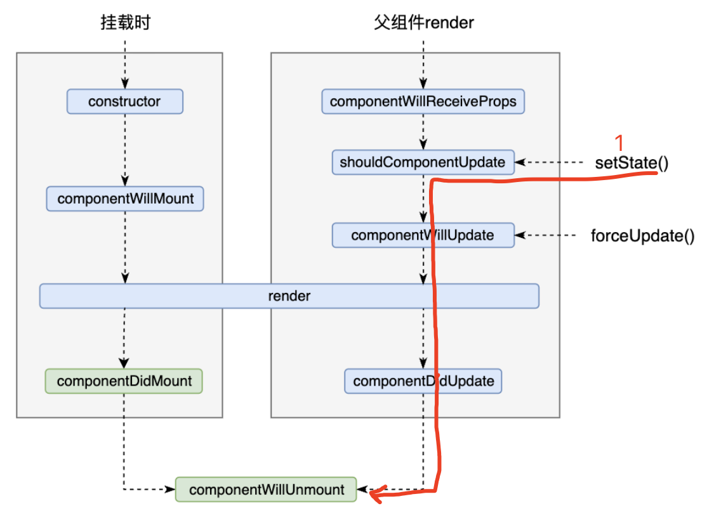


- setState 更新阶段

  - 执行setState->shouldComponentUpdate->componentWillUpdate->render->componentDidUpdate

    ```
    执行setState：更改组件状态触发更新
    
    
    shouldComponentUpdate：判断是否需要更新，返回布尔值
    
    
    componentWillUpdate：执行render前的一个钩子函数，在react17中将要弃用这个钩子
    
    
    render：和初始化时候执行的那个render一样，只是这里是更新值的，所以dom节点会重新更新一下
    
    
    componentDidUpdate：组件更新完毕执行的钩子函数。
    ```


#### 第6集 深入理解React的生命周期（旧）—forceUpdate更新阶段

**简介：forceUpDate更新阶段**

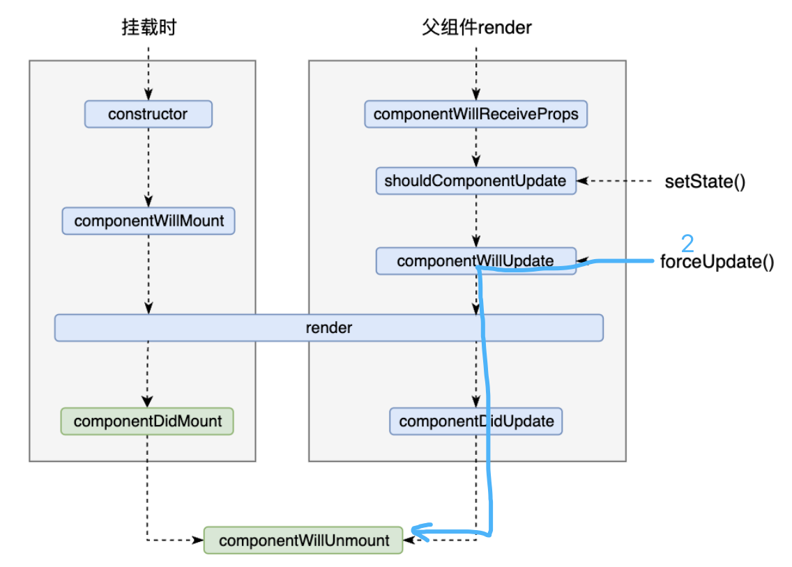


- forceUpDate更新阶段（强制更新）
  - 执行forceUpdate->componentWillUpdate->render->componentDidUpdate


#### 第7集 深入理解React的生命周期（旧）—父组件render更新阶段

**简介：父组件render更新阶段**


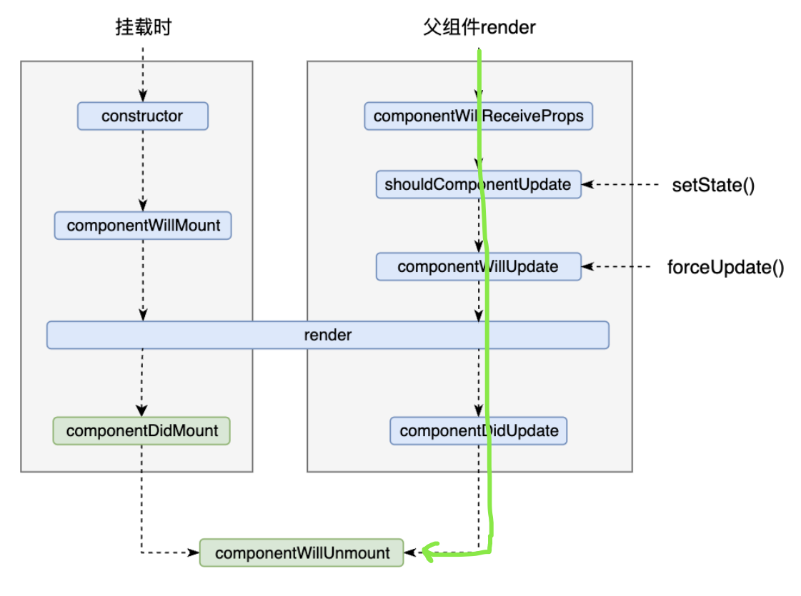

-  父组件render更新阶段
  - 执行componentWillReceiveProps->shouldComponentUpdate->componentWillUpdate->render->componentDidUpdate


#### 第8集 深入理解React的生命周期《新》—getDerivedStateFromProps

**简介：深入理解React的生命周期《新》**

- 新版react生命周期函数

  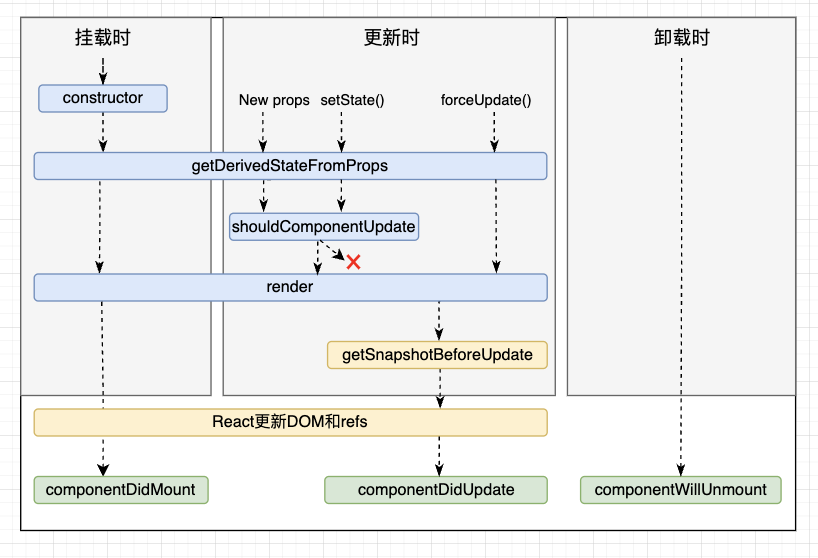

- 对比旧生命周期函数

  - 去除了三个生命周期函数
    - componentWillMount
    - componentWillUpdate
    - componentWillReceiveProps

  - 新增了两个生命周期函数
    - getDerivedStateFromProps
      - 当前组件任何时候使用props来决定state
    - getSnapshotBeforeUpdate		


#### 第9集 深入理解React的生命周期《新》—getSnapshotBeforeUpdate

**简介：深入理解React的生命周期《新》**


- getSnapshotBeforeUpdate

  - 更新之前获取快照

    ```js
    getSnapshotBeforeUpdate(prevProps, prevState){
      console.log('getSnapshotBeforeUpdate',prevProps, prevState)
      return 'xdclass.net'
    }
    ```

    


	
				**愿景："让编程不再难学，让技术与生活更加有趣"**

**更多课程请访问 xdclass.net**

### 第五章 React的refs和表单组件

#### 第1集 React中refs的使用—字符串形式的ref

**简介：React中refs的使用**

- ref
  - 组件中的标签可以通过定义ref属性来标识自己


- 字符串ref基本使用

  ```jsx
  import React from "react";
  
  class App extends React.Component {
    popClick = () => {
      console.log(this);
      const { inputRef } = this.refs;
      alert(inputRef.value);
    };
  
    render() {
      return (
        <>
          <input ref="inputRef" type="text" placeholder="请输入内容" />
          <button onClick={this.popClick}>点击生成弹窗</button>
        </>
      );
    }
  }
  export default App;
  ```

  

- 存在效率的问题
  - https://github.com/facebook/react/pull/8333#issuecomment-271648615


#### 第2集 React中refs的使用—回调形式的ref

**简介：React中refs的使用**

- 回调形式的ref基本使用

  ```jsx
  import React from "react";
  
  class App extends React.Component {
    popClick = () => {
      console.log(this);
      alert(this.input1.value);
    };
  
    render() {
      return (
        <>
          <input
            ref={(a) => (this.input1 = a)}
            type="text"
            placeholder="请输入内容"
          />
          <button onClick={this.popClick}>点击生成弹窗</button>
        </>
      );
    }
  }
  export default App;
  ```

  

- 关于回调ref调用的次数（无关紧要）

  - 如果 `ref` 回调函数是以内联函数的方式定义的，在更新过程中它会被执行两次
  - 通过将 ref 的回调函数定义成 class 的绑定函数

  ```jsx
  import React from "react";
  
  class App extends React.Component {
    state = { xd: true };
  
    popClick = () => {
      console.log(this);
      alert(this.input1.value);
    };
  
    handleClick = () => {
      this.setState({ state: !this.state.xd });
    };
  
    render() {
      return (
        <>
          <input
            ref={(a) => ((this.input1 = a), console.log(11))}
            type="text"
            placeholder="请输入内容"
          />
          <button onClick={this.popClick}>点击生成弹窗</button>
          <button onClick={this.handleClick}>点击更新组件</button>
        </>
      );
    }
  }
  export default App;
  ```


#### 第3集 React中refs的使用—createRef创建ref

**简介：React中refs的使用**

- createRef
  - Refs 是使用 `React.createRef()` 创建的，并通过 `ref` 属性附加到 React 元素。在构造组件时，通常将 Refs 分配给实例属性，以便可以在整个组件中引用它们
  - `React.createRef()` 调用后可以想象城创建了一个容器，这个容器可以储存被ref标识的元素节点
  - 创建了一个容器只能绑定一个节点，绑定多个节点会被覆盖

 

- createRef的基本使用

  ```jsx
  import React from "react";
  
  class App extends React.Component {
    inputRef = React.createRef();
    popClick = () => {
      console.log(this);
      alert(this.inputRef.current.value);
    };
  
    render() {
      return (
        <>
          <input ref={this.inputRef} type="text" placeholder="请输入内容" />
          <button onClick={this.popClick}>点击生成弹窗</button>
          <button onClick={this.handleClick}>点击更新组件</button>
        </>
      );
    }
  }
  export default App;
  ```

  


- 不要过度使用ref

  ```jsx
  import React from "react";
  
  class App extends React.Component {
    inputRef = React.createRef();
    popClick = () => {
      console.log(this);
      alert(this.inputRef.current.value);
    };
  
    handleClick = (e) => {
      console.log(e.target.value);
    };
  
    render() {
      return (
        <>
          <input ref={this.inputRef} type="text" placeholder="请输入内容" />
          <button onClick={this.popClick}>点击生成弹窗</button>
          <input onBlur={this.handleClick}></input>
        </>
      );
    }
  }
  export default App;
  ```

  


#### 第4集 React中的非受控组件和受控组件

**简介：非受控组件和受控组件**

- 非受控组件

  - 由组件自身来管理其状态的组件


  ```jsx
  import React from "react";
  
  class App extends React.Component {
    handleSubmit = (e) => {
      e.preventDefault();
      alert(this.name.value);
    };
    render() {
      return (
        <form onSubmit={this.handleSubmit}>
          <label>
            名字:
            <input type="text" ref={(a) => (this.name = a)} />
          </label>
          <button type="submit">提交</button>
        </form>
      );
    }
  }
  export default App;
  ```

  

- 受控组件

  ```
  组件内部维护state，state属性和表单元素的值建立依赖关系，再通过onChange事件与setState()结合更新state属性，就能达到控制用户输入过程中表单发生的操作，控制取值的表单输入元素就叫做受控组件（类似vue的数据双向绑定）
  ```

  ```jsx
  import React from "react";
  
  class App extends React.Component {
    state = { value: "小滴课堂" };
    handleChange = (event) => {
      console.log(event.target.value);
      this.setState({ value: event.target.value });
    };
  
    handleSubmit = (e) => {
      // 禁止表单的默认刷新
      e.preventDefault();
      alert(this.state.value);
    };
  
    render() {
      return (
        <form onSubmit={this.handleSubmit}>
          <label>
            名字:
            <input
              value={this.state.value}
              type="text"
              onChange={this.handleChange}
            />
          </label>
          <button type="submit">提交</button>
        </form>
      );
    }
  }
  export default App;
  ```

  


#### 第5集 【面试】剖析React中的Diffing算法

**简介：剖析React中的Diffing算法**

- React/vue框架面试题
  - 框架中为什么要使用虚拟DOM？Diffing算法原理是什么？
  - 遍历数组渲染数据时，为什么要是加key属性，用index作为key会有什么问题？


- diff算法
  - 当数据改变时，react会生成新的虚拟dom和旧的虚拟dom进行对比，有不同的节点则重新生成，节点相同则进行复用，不重新生成，提高渲染速度


- key值
  - `key`主要用在 Vue 虚拟 DOM（类似 js 对象格式的数据） 的 Diff 算法，新旧虚拟 DOM 对比，复用不变的旧节点，渲染改变的节点，提高渲染速度
  - 遍历数组不加`key`属性时，则默认使用数组的索引index，在数组元素顺序打乱时，会产生不必要的DOM更新
  - `key`值要使用唯一的id值


- 案例

  ```jsx
  import React from "react";
  
  class App extends React.Component {
    state = {
      list: [
        { id: 1, name: "冰冰", hobby: "喝奶茶" },
        { id: 2, name: "anna", hobby: "喝奶茶" },
        { id: 3, name: "老帆", hobby: "打篮球" },
      ],
    };
  
    addClick = () => {
      const newItem = { id: 4, name: "老王", hobby: "按摩" };
      this.setState({ list: [newItem, ...this.state.list] });
    };
  
    // 一.使用index作为key值
    // 初始数据
    // { id:1,name: "冰冰", hobby: "喝奶茶" },
    // { id:2,name: "anna", hobby: "逛街" },
    // { id:3,name: "老帆", hobby: "打篮球" },
  
    // 初始虚拟dom
    // <li key=0>名字：冰冰，爱好：喝奶茶</li>
    // <li key=1>名字：anna，爱好：逛街</li>
    // <li key=2>名字：老帆，爱好：打篮球</li>
  
    // 更新后的数据
    // { id:4,name: "老王", hobby: "按摩" },
    // { id:1,name: "冰冰", hobby: "喝奶茶" },
    // { id:2,name: "anna", hobby: "逛街" },
    // { id:3,name: "老帆", hobby: "打篮球" },
  
    // 更新后的虚拟dom
    // <li key=0>名字：老王，爱好：喝奶茶</li>
    // <li key=1>名字：冰冰，爱好：喝奶茶</li>
    // <li key=2>名字：anna，爱好：逛街</li>
    // <li key=3>名字：老帆，爱好：打篮球</li>
  
    // 二.使用唯一值id作为key值
    // 初始数据
    // {id:1, name: "冰冰", hobby: "喝奶茶" },
    // {id:2,name: "anna", hobby: "逛街" },
    // {id:3, name: "老帆", hobby: "打篮球" },
  
    // 初始虚拟dom
    // <li key=1>名字：冰冰，爱好：喝奶茶</li>
    // <li key=2>名字：anna，爱好：逛街</li>
    // <li key=3>名字：老帆，爱好：打篮球</li>
  
    // 更新后的数据
    // {id:4, name: "老王", hobby: "按摩" },
    // {id:1, name: "冰冰", hobby: "喝奶茶" },
    // {id:2, name: "anna", hobby: "逛街" },
    // {id:3, name: "老帆", hobby: "打篮球" },
  
    // 更新后的虚拟dom
    // <li key=4>名字：老王，爱好：喝奶茶</li>
    // <li key=1>名字：冰冰，爱好：喝奶茶</li>
    // <li key=2>名字：anna，爱好：逛街</li>
    // <li key=3>名字：老帆，爱好：打篮球</li>
  
    render() {
      return (
        <>
          <h1>小滴课堂人员列表</h1>
          <input type="text" />
          <ul>
            {this.state.list.map((item, index) => {
              return (
                <li key={index}>
                  名字：{item.name}，爱好：{item.hobby}
                </li>
              );
            })}
          </ul>
          <button onClick={this.addClick}>添加人员按钮</button>
        </>
      );
    }
  }
  export default App;
  ```

  


	
				**愿景："让编程不再难学，让技术与生活更加有趣"**

**更多课程请访问 xdclass.net**

### 第六章 React的路由和状态管理

#### 第1集 深入理解路由的概念

**简介：深入理解路由的概念**


- 定义

  - 路由（router）就是一组映射关系： `key-value` ，`key` 为路径，`value` 为 `component` 组件 ，由 `router` 管理

  - 结合生活中的路由

    - 在生活的路由器中 `LAN` 代表 `路径`，通过网线与LAN连接的 `电脑` 代表 `组件`

     

- 工作流程

  - 当 `router` 检测到路径发生改变时，就会将当前页面替换成对应的组件

     

 

 

 

#### 第2集 认识React的路由插件react-router-dom和基本使用

**简介：认识React的路由插件react-router-dom和基本使用**

- react的路由 react-router 分类
  - web使用
    - react-router-dom
  - native使用
    - react-router-native
  - anywhere（使用麻烦）
    - react-router


- react-router-dom

  - 安装

    ```
    yarn add react-router-dom
    ```

  - 基本使用

    ```jsx
    import React from "react";
    import ReactDOM from "react-dom/client";
    import App from "./App.jsx";
    import { BrowserRouter } from "react-router-dom";
    
    ReactDOM.createRoot(document.getElementById("root")).render(
      <React.StrictMode>
        <BrowserRouter>
          <App text={"react"} />
        </BrowserRouter>
      </React.StrictMode>
    );
    ```

    ```jsx
    import React from "react";
    import About from "./components/About";
    import Home from "./components/Home";
    import { Link, Route, Routes } from "react-router-dom";
    import "./app.css";
    
    class App extends React.Component {
      render() {
        return (
          <div className="all">
            <div>
              <div className="link">
                <Link to="/home">打开首页的页面</Link>
              </div>
              <div className="link">
                <Link to="/about">打开关于的页面</Link>
              </div>
            </div>
            <div className="view">
              <Routes>
                <Route path="/about" element={<About />} />
                <Route path="/home" element={<Home />} />
              </Routes>
            </div>
          </div>
        );
      }
    }
    export default App;
    ```

    


#### 第3集 路由中重定向和路由表的使用

**简介：路由中重定向和路由表的使用**

- 重定向

  ```jsx
  <Route path="/" element={<Navigate to="about" />} />
  ```


- 路由表的使用

  - 引入

    ```
    const element = useRoutes(routes);
    ```

  - 路由表

    ```jsx
    import { Navigate } from "react-router-dom";
    import About from "../components/About";
    import Home from "../components/Home";
    
    export default [
      {
        path: "/home",
        element: <Home />,
      },
      {
        path: "/about",
        element: <About />,
      },
      {
        path: "/",
        element: <Navigate to="about" />,
      },
    ];
    ```

    


#### 第4集 玩转选中高亮和嵌套路由使用

**简介：玩转选中高亮和嵌套路由使用**

- 选中高亮 NavLink

  ```jsx
  import React from "react";
  import { NavLink, useRoutes } from "react-router-dom";
  import "./app.css";
  import routes from "./routes";
  
  const App = () => {
    const element = useRoutes(routes);
    const activeStyle = ({ isActive }) => {
      console.log(isActive);
      return isActive ? "background" : "";
    };
    return (
      <div className="all">
        <div>
          <NavLink to="/home" className={activeStyle}>
            打开首页的页面
          </NavLink>
          <NavLink to="/about" className={activeStyle}>
            打开关于的页面
          </NavLink>
        </div>
        <div className="view">{element}</div>
      </div>
    );
  };
  export default App;
  ```

  

- 嵌套路由

  ```jsx
  import React from "react";
  import { Outlet, NavLink } from "react-router-dom";
  class Home extends React.Component {
    render() {
      return (
        <div>
          首页的页面
          <div
            style={{
              display: "flex",
              justifyContent: "center",
              marginTop: "20px",
            }}
          >
            <NavLink to="classify" className="background">
              classify
            </NavLink>
            <NavLink to="navigation" className="background">
              navigation
            </NavLink>
          </div>
          <div style={{ background: "red" }}>
            <Outlet />
          </div>
        </div>
      );
    }
  }
  export default Home;
  ```

  ```js
  children: [
    {
      path: "classify",
      element: <Classify />,
    },
    {
      path: "navigation",
      element: <Navigation />,
    },
  ],
  ```

  


#### 第5集 使用路由Params进行传递参数

**简介：使用路由进行传递参数**

- 使用useParams接受参数

  ```jsx
  import React from "react";
  import { useParams } from "react-router-dom";
  
  const Classify = () => {
    const params = useParams();
    return (
      <div>
        分类
        <div>父组件home传递的参数:{params.xd}</div>
      </div>
    );
  };
  export default Classify;
  
  ```

  


#### 第6集 使用路由search进行传递参数

**简介：使用路由进行传递参数**

- 使用useSearchParams接受参数

  ```jsx
  import React from "react";
  import { useSearchParams } from "react-router-dom";
  
  const Classify = () => {
    const [search,setSearch] = useSearchParams();
    const xd =search.get('xd')
    const website =search.get('website')
    return (
      <div>
        分类
        <div>父组件home传递的参数:{xd}-{website}</div>
        <button onClick={()=>setSearch('xd=老王&website=laowang.com')}></button>
      </div>
    );
  };
  export default Classify;
  
  ```

  


#### 第7集 使用路由state进行传递参数

**简介：使用路由state进行传递参数**

- 使用路由state进行传递参数

  ```jsx
  import React from "react";
  import { useLocation } from "react-router-dom";
  
  const Classify = () => {
    const {
      state: { xd, website },
    } = useLocation();
    return (
      <div>
        分类
        <div>
          父组件home传递的参数:{xd}-{website}
        </div>
      </div>
    );
  };
  export default Classify;
  ```

  


#### 第8集 剖析编程式路由导航

**简介：剖析编程式路由导航**

- useNavigate()

  ```js
  const navigate = useNavigate();
  const toClassify = () => {
    navigate("classify", {
      state: { xd: "小滴课堂", website: "xdclass.net" },
    });
  };
  ```

  


#### 第9集 深入理解React的状态管理Redux

**简介：深入理解React的状态管理Redux**

- 官网
  - 英文官网：https://redux.js.org/
  - 中文官网：https://cn.redux.js.org/


- 定义
  - 用做于状态管理的第三方 js 库
  - react框架中使用，也可应用于其他的框架


- 使用场景
  - 组件间需要共享状态和改变另一个组件的状态
  - 在react项目中可以不使用就尽量不用，复杂场景下才使用


- 为什么要使用Redux 

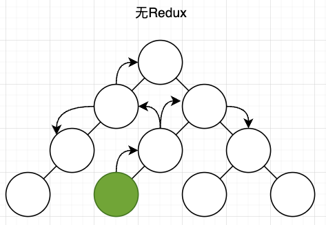				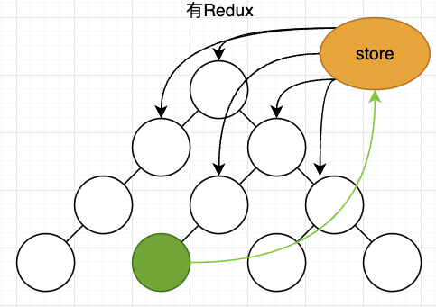


- 原理图

  

  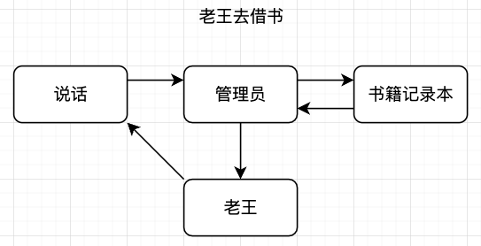

  

  

  


​	


#### 第10集 剖析Redux的工作流程

**简介：剖析Redux的工作流程**

- 安装

  ```
  yarn add @reduxjs/toolkit react-redux
  ```

  

- 配置

  - 在主程序入口配置store

    ```js
    import React from "react";
    import ReactDOM from "react-dom/client";
    import App from "./App.jsx";
    import { Provider } from "react-redux";
    import store from "store";
    
    ReactDOM.createRoot(document.getElementById("root")).render(
      <React.StrictMode>
        <Provider store={store}>
          <App text={"react"} />
        </Provider>
      </React.StrictMode>
    );
    ```

  - 新建store

    ```js
    // store/index.js
    import { configureStore } from "@reduxjs/toolkit";
    // 引入 reducer 函数
    import counterSlice from "./modules/counterSlice";
    
    // 使用configureStore创建一个redux仓库
    // 并自动配置了 Redux DevTools 扩展 ，这样你就可以在开发时调试 store
    export default configureStore({
      reducer: {
        // 告诉 store 使用这个 slice reducer 函数来处理对该状态的所有更新
        counter: counterSlice,
      },
    });
    ```

    

  - 新建某个reducer

    ```js
    //modules/counterSlice.js
    import { createSlice } from "@reduxjs/toolkit";
    
    // 创建react数据切片 利用createSlice()
    export const counterSlice = createSlice({
      // 类似于vuex的命名空间，必须是唯一值
      // 与pinia的defineStore()的第一个参数一个意思，都是唯一值，做区分
      name: "counter",
      // 变量
      initialState: {
        value: 0,
        list: [1, 1, 1],
      },
      // 方法
      reducers: {
        // 方法接收2个参数，第一个参数是变量，第二个参数是载荷(也就是使用方法传入的参数)
        increment: (state) => {
          state.value += 1;
          state.list.push(1);
        },
        decrement: (state) => {
          state.value -= 1;
          state.list.pop(1);
        },
      },
    });
    // 每个 case reducer 函数会生成对应的 Action creators
    export const { increment, decrement } = counterSlice.actions;
    
    export default counterSlice.reducer;
    ```

  - 使用

    ```js
    import React from "react";
    import { useSelector, useDispatch } from "react-redux";
    import { decrement, increment } from "./store/modules/counterSlice";
    
    export default function Person() {
      const { value, list } = useSelector((state) => state.counter);
      const dispatch = useDispatch();
    
      return (
        <div>
          <h2>Person -- {value}</h2>
          <h2>list -- {list.length}</h2>
          <button onClick={() => dispatch(increment())}>增加</button>
          <button onClick={() => dispatch(decrement())}>减少</button>
        </div>
      );
    }
    ```

    

  


	
				**愿景："让编程不再难学，让技术与生活更加有趣"**

**更多课程请访问 xdclass.net**

### 第七章 React组件的扩展和函数式组件

#### 第1集 【面试】React中setState是同步还是异步的？

**简介：React中setState的扩展使用**

- setState是同步还是异步的？

  - 在react18版本之前setState既可以是同步也可以是异步的
    - 在Promise的状态更新、js原生事件、定时器中是同步的
    - 在react的合成事件中，是异步的

  - 在react18版本之后是setState异步的


- 代码验证

  ```jsx
  import React from "react";
  class App extends React.Component {
    state = { counte: 0 };
    add = () => {
      this.setState({ counte: this.state.counte + 1 });
      console.log("更新后打印的值：", this.state.counte);
    };
  
    render() {
      return (
        <div>
          <h2>{this.state.counte}</h2>
          <button onClick={this.add}>增加</button>
        </div>
      );
    }
  }
  export default App;
  ```

  


- 如何拿到更新后的值

  ```jsx
  this.setState({ counte: this.state.counte + 1 }, () => {
    console.log("更新后的值：", this.state.counte);
  });
  ```

  

- 函数写法

  ```
  this.setState(
    () => ({ counte: this.state.counte + 1 }),
    () => {console.log("更新后的值：", this.state.counte)}
  );
  ```

  


#### 第2集 【面试】React中路由懒加载的扩展使用

**简介：React中路由懒加载的扩展使用**

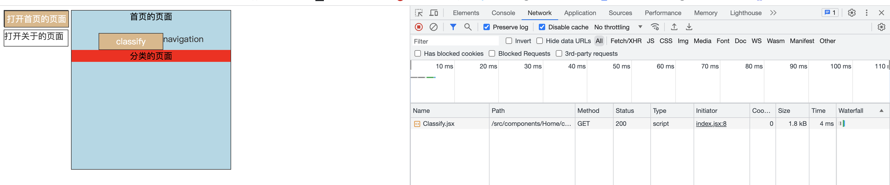

- 路由懒加载 lazy

  - 配置

    ```jsx
    import { lazy } from "react";
    
    //动态引入路径传入lazy函数
    const Classify = lazy(() => import("../components/Home/components/Classify"));
    const Navigation = lazy(() =>
      import("../components/Home/components/Navigation")
    );
    ```

  - 使用

    ```jsx
    <Suspense fallback={<h2>loading...</h2>}>
      <Outlet />
    </Suspense>
    ```


#### 第3集 React函数组件状态Hook—useState《基础》  

**简介：React函数组件状态—state**

- Hooks
  - Hooks是 React16.8 版本新增加的特性语法
  - 在函数组件中可以通过 Hooks 维护自身的 state 和其他的 React 特性


- 常用的Hooks
  - state hook：useState()
  - effect hook：useEffect()
  - ref hook：useRef()


- 在函数组件中维护自身的 state 

  ```jsx
  import React, { useState } from "react";
  
  const App = () => {
    const [counte, setCounte] = useState(0);
    const add = () => {
      setCounte(counte + 1);
    };
    return (
      <div>
        <h1>小滴课堂</h1>
        <div>当前的计数：{counte}</div>
        <button onClick={add}>增加</button>
      </div>
    );
  };
  export default App;
  ```

  - 改变状态的第一种写法

    ```js
    const add = () => {
      setCounte(counte + 1);
    };
    ```

  - 改变状态的第二种写法

    ```js
    const add = () => {
      setCounte((counte) => {
        return counte + 1;
      });
    };
    ```

    

- 维护多个state

  ```jsx
  import React, { useState } from "react";
  
  const App = () => {
    const [counte, setCounte] = useState(0);
    const [title, setTitle] = useState("小滴课堂");
    const add = () => {
      setCounte((counte) => {
        return counte + 1;
      });
    };
    const changeName = () => {
      setTitle("xdclass.net");
    };
    return (
      <div>
        <h1>{title}</h1>
        <div>当前的计数：{counte}</div>
        <button onClick={add}>增加</button>
        <button onClick={changeName}>更改title</button>
      </div>
    );
  };
  export default App;
  ```

  


#### 第4集 React函数组件状态Hook—useState《进阶-对象》

**简介：React函数组件状态—state**

- 对象 state

  - 官网说明：https://react.docschina.org/learn/updating-objects-in-state

    - state 中可以保存任意类型的 JavaScript 值，包括对象。但是，你不应该直接修改存放在 React state 中的对象。相反，当你想要更新一个对象时，你需要创建一个新的对象（或者将其拷贝一份），然后将 state 更新为此对象。

      

  - 改变对象state逻辑

    - 把所有存放在 state 中的 JavaScript 对象都视为只读的
    - 你需要创建一个新对象并把它传递给 state 的设置函数
    - 使用扩展运算符拷贝对象 `...`

    ```jsx
    import React, { useState } from "react";
    
    const App = () => {
      const [message, setMessage] = useState({
        name: "小滴课堂",
        website: "xdclass.net",
      });
    
      const changeName = () => {
        setMessage({ ...message, name: "广州小滴科技" });
      };
    
      return (
        <div>
          <h1>{message.name}</h1>
          <h1>{message.website}</h1>
          <button onClick={changeName}>更改title</button>
        </div>
      );
    };
    export default App;
    ```

    

  - 改变嵌套对象逻辑

    - `...` 展开语法本质是“浅拷贝”，它只会复制一层。当你想要更新一个嵌套属性时，你必须得多次使用展开语法。

    ```js
    setMessage({ ...message, staff: { ...message.staff, hobby: "洗脚" } });
    ```

    

  

  - 使用 Immer 编写简洁的更新逻辑（针对复杂的对象数据）

    - 如果你的 state 有多层的嵌套，你或许应该考虑将其扁平化。但是，如果你不想改变 state 的数据结构，你可能更喜欢用一种更便捷的方式来实现嵌套展开的效果。

    - Immer是一个非常流行的库，它可以让你使用简便但可以直接修改的语法编写代码，并会帮你处理好复制的过程

    - 安装

      ```js
      yarn add immer use-immer
      ```

      ```js
      setMessage((draft) => {
        draft.name = "广州小滴科技";
      });
      ```

      

    

​		


#### 第5集 React函数组件状态Hook—useState《进阶-数组》

**简介：React函数组件状态—state**

- 数组 state

  - 官网说明

    - 数组是另外一种可以存储在 state 中的 JavaScript 对象，它虽然是可变的，但是却应该被视为不可变。同对象一样，当你想要更新存储于 state 中的数组时，你需要创建一个新的数组（或者创建一份已有数组的拷贝值），并使用新数组设置 state

      

  - 改变数组state逻辑

    - 数组是另一种对象，你需要将 React state 中的数组视为只读的

    - 不能直接修改原数组，相反，需要生成一个新的数组

      |          | 避免使用 (会改变原始数组)     | 推荐使用 (会返回一个新数组）  |
      | -------- | ----------------------------- | ----------------------------- |
      | 添加元素 | `push`，`unshift`             | `concat`，`[...arr]` 展开语法 |
      | 删除元素 | `pop`，`shift`，`splice`      | `filter`，`slice`             |
      | 替换元素 | `splice`，`arr[i] = ...` 赋值 | `map`                         |
      | 排序     | `reverse`，`sort`             | 先将数组复制一份              |

  

  - 数组添加元素

    ```jsx
    import { useState } from "react";
    const App = () => {
      const [name, setName] = useState("");
      const [person, setPerson] = useState([{ id: 0, name: "老王" }]);
    
      return (
        <>
          <h1>小滴课堂的员工列表：</h1>
          <input value={name} onChange={(e) => setName(e.target.value)} />
          <button
            onClick={() => {
              setPerson([...person, { id: person.length, name: name }]);
            }}
          >
            添加
          </button>
          <ul>
            {person.map((item) => (
              <li key={item.id}>{item.name}</li>
            ))}
          </ul>
        </>
      );
    };
    
    export default App;
    ```

    

  - 数组删除元素

    ```js
    setPerson(person.filter((i) => i.id !== item.id));
    ```

    

  - 使用Immer编写简洁代码逻辑

    ```jsx
    import { useState } from "react";
    import { useImmer } from "use-immer";
    const App = () => {
      const [name, setName] = useState("");
      const [person, setPerson] = useImmer([{ id: 0, name: "老王", check: false }]);
      const deleteTab = (item) => {
        setPerson(person.filter((i) => i.id !== item.id));
      };
      const handleCheck = (id, checked) => {
        setPerson((draft) => {
          const checkItem = draft.find((i) => i.id === id);
          checkItem.check = checked;
        });
      };
      return (
        <>
          <h1>小滴课堂的员工列表：</h1>
          <input value={name} onChange={(e) => setName(e.target.value)} />
          <button
            onClick={() => {
              setPerson([
                ...person,
                { id: person.length, name: name, check: false },
              ]);
            }}
          >
            添加
          </button>
          <ul>
            {person.map((item) => (
              <li key={item.id}>
                <input
                  type="checkbox"
                  checked={item.check}
                  onChange={(e) => handleCheck(item.id, e.target.checked)}
                ></input>
                {item.name}
                <button onClick={() => deleteTab(item)}>删除</button>
              </li>
            ))}
          </ul>
        </>
      );
    };
    
    export default App;
    ```

    


#### 第6集 React函数组件的副作用Hook—useEffect

**简介：React函数组件的副作用Hook—useEffect**


- useEffect的使用

  - 使用useEffect实现计数器小案例

    ```jsx
    import React, { useEffect, useState } from "react";
    import { root } from "./main";
    
    const App = () => {
      const [counte, setCounte] = useState(0);
      const [name, setName] = useState("小滴课堂");
      // 增加
      const add = () => {
        setCounte((counte) => counte + 1);
      };
    
      // 改变
      const change = () => {
        setName("xdclass.net");
      };
    
      // 卸载组件
      const handelDelete = () => {
        root.unmount();
      };
    
      useEffect(() => {
        let timer = setInterval(() => {
          setCounte((counte) => counte + 1);
        }, 1000);
        return () => {
          clearInterval(timer);
          console.log("组件卸载了");
        };
      }, []);
    
      return (
        <div>
          <h1>当前的计数：{counte}</h1>
          <button onClick={add}>增加</button>
          <h1>{name}</h1>
          <button onClick={change}>改变</button>
          <button onClick={handelDelete}>卸载组件</button>
        </div>
      );
    };
    
    export default App;
    ```

    


	
				**愿景："让编程不再难学，让技术与生活更加有趣"**

**更多课程请访问 xdclass.net**

### 第八章 React实战演练项目—小滴课堂首页

#### 第1集 小滴课堂项目页面需求分析

**简介：小滴课堂项目页面需求分析**


- 页面组件拆分
  - 头部
    - 导航tab
    - 搜索框
    - 登录注册
  - 中间
    - 分类导航
    - 轮播图
    - 新人福利
    - 高单价产品导航
  - 课程分类列表
  - 底部内容
  - 登录提醒浮层
  - 登录/注册弹窗


#### 第2集 React初始化项目搭建

**简介：React初始化项目搭建**

- 项目搭建

  - 替换网页图标

    

- 代码维护远程仓库 Gitee

  - 项目 git 初始化

    ```
    git init
    ```

  - Gitee创建仓库

  - 本地项目设置远程仓库地址

    ```
    git remote add origin xxxx
    ```

    


#### 第3集 React项目初始化配置Ant-Design+Unocss

**简介：React项目初始化配置组件库+Unocss**

- 配置 Ant-Design

  ```
  yarn add antd
  ```

  ```jsx
  import { Button } from 'antd';
  
  <Button type="primary">Button</Button>
  ```

  

- 配置 Unocss

  ```
  yarn add unocss
  ```

  ```jsx
  import { defineConfig, presetAttributify, presetUno } from "unocss";
  
  export default defineConfig({
    presets: [
      presetAttributify(),
      presetUno(),
    ],
  });
  ```

  ```ts
  // vite.config.ts
  import UnoCSS from "unocss/vite";
  
  export default defineConfig({
    plugins: [
    	UnoCSS()
    ]
  })
  ```

  ```js
  // main.tsx
  import "virtual:uno.css";
  ```

  - 安装unocss插件（优势会不生效显示样式，不影响使用）

  - 搜索其他的样式使用

    ```
    https://www.tailwindcss.cn/
    ```

    

- 自动引入插件配置

  ```
  yarn add unplugin-auto-import/vite
  ```

  ```js
  import AutoImport from "unplugin-auto-import/vite";
  import { defineConfig } from 'vite'
  
  export default defineConfig({
  plugins: [
    AutoImport({
      dts: 'src/types/auto-imports.d.ts',
      imports: ['react'],
      dirs: ['./src/hooks']
      }),
    ]
  })
  ```

  


#### 第4集 小滴课堂首页开发—头部导航

**简介：小滴课堂首页开发—头部导航**


- 代码开发

  ```jsx
  import { Input } from "antd";
  import { DownOutlined } from "@ant-design/icons";
  
  // 接口定义
  interface HeaderItemProps {
    href: string;
    title?: string;
    children?: React.ReactNode;
  }
  
  // 高阶组件（组件为参数，返回组件）
  function HeaderItem(props: HeaderItemProps) {
    return (
      <a className="c-#4f555d hover:c-#F38E48" href={props.href}>
        {props.children ?? props.title}
      </a>
    );
  }
  
  // 头部导航组件
  export default function Header() {
    // 每项tab的配置
    const list = [
      {
        title: "首页",
        href: "#",
      },
      {
        title: "课程中心",
        href: "#",
      },
      {
        title: "超级会员",
        href: "#",
        children: (
          <div className="flex items-center justify-center">
            
            <span>超级会员</span>
          </div>
        ),
      },
      {
        title: "工具",
        href: "#",
      },
      {
        title: "自学路线",
        href: "#",
        children: (
          <>
            <span>自学路线</span>
            <DownOutlined />
          </>
        ),
      },
      {
        title: "一对一辅导",
        href: "#",
        children: (
          <>
            <span>一对一辅导</span>
            <DownOutlined />
          </>
        ),
      },
      {
        title: "搜索",
        href: "#",
        children: (
          <Input.Search placeholder="请输入搜索内容" className="w-220px" />
        ),
      },
      {
        title: "兑换码",
        href: "#",
      },
      {
        title: "云服务器",
        href: "#",
      },
    ];
  
    return (
      <div className="flex items-center gap-2">
        {/* 官网图标 */}
        
        {/* tab导航项 */}
        <div className="flex items-center justify-between flex-[1]">
          {list.map((item) => (
            <HeaderItem key={item.title} title={item.title} href={item.href}>
              {item?.children}
            </HeaderItem>
          ))}
        </div>
        {/* 注册登录 */}
        <div className="flex items-center justify-center gap-4 children:cursor-pointer">
          <span>登录</span>
          <span className="bg-#4d555d c-white h-30px leading-26px w-60px p-2px text-center">
            注册
          </span>
        </div>
      </div>
    );
  }
  ```

  


#### 第5集 小滴课堂首页开发—注册模块

**简介：小滴课堂首页开发—注册模块**

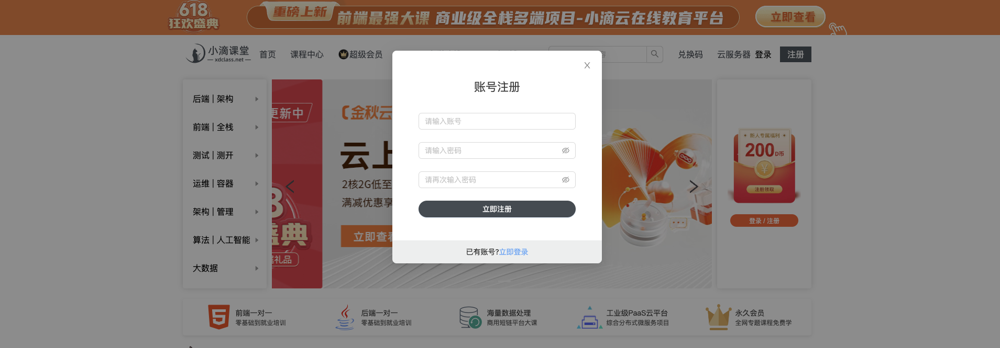


- 代码开发

  ```jsx
  import { Modal, Form, Input, Button, message } from "antd";
  
  export function Register() {
    // 账号
    const [account, setAccount] = useState("");
    // 密码
    const [password, setPassword] = useState("");
    // 确认密码
    const [rePassword, setRePassword] = useState("");
    // 全局公共个人状态
    const { register, users } = useUser();
    // 全局公共注册弹窗状态
    const { regVisible, switchRegVisible } = useModal();
  
    // 注册提交按钮
    function handleFinish() {
      // 密码验证;
      if (password !== rePassword) {
        message.warning("两次密码不一致");
        return;
      } else {
        // 账号验证
        if (users.some((user) => user.account === account)) {
          message.warning("该账号已存在");
        } else {
          // 注册
          register(account, password);
          // 关闭注册弹窗
          switchRegVisible();
          message.success("注册成功");
        }
      }
    }
  
    return (
      <Modal
        width="400px"
        open={regVisible}
        footer={null}
        className="relative"
        onCancel={() => switchRegVisible()}
      >
        <h1 className="text-center c-#404040 text-22px font-normal my-8">
          密码登录
        </h1>
        <div className="pb-44px flex items-center justify-center w-full">
          <Form
            name="basic"
            style={{ width: "300px" }}
            initialValues={{ remember: true }}
            autoComplete="off"
            onFinish={handleFinish}
          >
            {/* 账号 */}
            <Form.Item name="account">
              <Input
                placeholder="请输入账号"
                value={account}
                onChange={(e) => setAccount(e.target.value)}
              />
            </Form.Item>
            {/* 密码 */}
            <Form.Item name="password">
              <Input.Password
                placeholder="请输入密码"
                value={password}
                onChange={(e) => setPassword(e.target.value)}
              />
            </Form.Item>
            {/* 确认密码 */}
            <Form.Item name="re-password">
              <Input.Password
                placeholder="请再次输入密码"
                value={rePassword}
                onChange={(e) => setRePassword(e.target.value)}
              />
            </Form.Item>
            {/* 注册 */}
            <Form.Item>
              <Button
                type="primary"
                htmlType="submit"
                className="flex w-full items-center justify-center bg-#444b52 text-white rounded-full"
              >
                <span>立即注册</span>
              </Button>
            </Form.Item>
          </Form>
        </div>
        {/* 跳转登录 */}
        <div className="absolute w-full h-44px bottom-0 left-0 bg-[rgba(77,85,93,0.1)] flex items-center justify-center">
          <span>已有账号?</span>
          <span className="text-blue-400 cursor-pointer">立即登录</span>
        </div>
      </Modal>
    );
  }
  ```

  


#### 第6集 小滴课堂首页开发—登录模块

**简介：小滴课堂首页开发—登录模块**

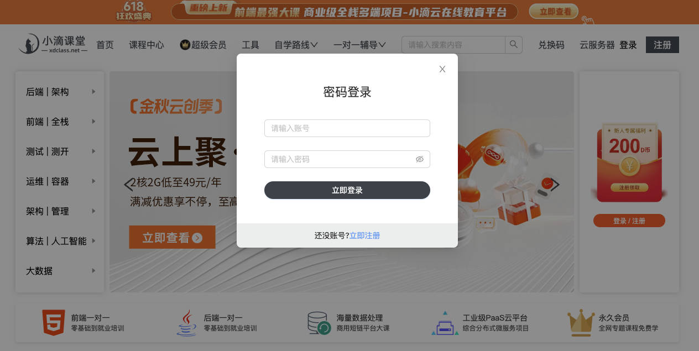


- 代码开发

  ```jsx
  import { Modal, Form, Input, Button } from "antd";
  
  export function Login() {
    // 登录
    const { login } = useUser();
    // 注册登录弹窗控制
    const { loginVisible, switchLoginVisible, switchRegVisible } = useModal();
    const [account, setAccount] = useState("");
    const [password, setPassword] = useState("");
  
    // 登录提交
    function handleFinish() {
      login(account, password);
      switchLoginVisible();
    }
  
    return (
      <Modal
        width="400px"
        open={loginVisible}
        footer={null}
        onCancel={switchLoginVisible}
        className="relative"
      >
        <h1 className="text-center c-#404040 text-22px font-normal my-8">
          账号登录
        </h1>
        <div className="pb-44px flex items-center justify-center w-full">
          <Form
            name="login"
            style={{ width: "300px" }}
            initialValues={{ remember: true }}
            autoComplete="off"
            onFinish={handleFinish}
          >
            <Form.Item name="account">
              <Input
                placeholder="请输入账号"
                value={account}
                onChange={(e) => setAccount(e.target.value)}
              />
            </Form.Item>
  
            <Form.Item name="password">
              <Input.Password
                placeholder="请输入密码"
                value={password}
                onChange={(e) => setPassword(e.target.value)}
              />
            </Form.Item>
  
            <Form.Item>
              <Button
                type="primary"
                htmlType="submit"
                className="flex w-full items-center justify-center bg-#444b52 text-white rounded-full"
              >
                <span>立即登录</span>
              </Button>
            </Form.Item>
          </Form>
        </div>
  
        <div className="absolute w-full h-44px bottom-0 left-0 bg-[rgba(77,85,93,0.1)] flex items-center justify-center">
          <span>还没账号?</span>
          <span
            className="text-blue-400 cursor-pointer"
            onClick={() => {
              switchLoginVisible();
              switchRegVisible();
            }}
          >
            立即注册
          </span>
        </div>
      </Modal>
    );
  }
  ```

  


#### 第7集 小滴课堂首页开发—分类导航+轮播图

**简介：小滴课堂首页开发—头部导航**


- 代码开发

  ```jsx
  import Header from "./components/Header";
  import Classify from "./components/Classify";
  import Swiper from "./components/Swiper";
  import UserProfileOrUnlogin from "./components/UserOrUnlogin";
  import EmploymentNav from "./components/EmploymentNav";
  
  export default function Index() {
    return (
      <>
        <div className="w-full of-hidden">
          {/* 海报图 */}
          
          {/* 头部导航 */}
          <div className="shadow mb-10px">
            <div className="w-1200px mx-auto">
              <Header />
            </div>
          </div>
          {/* 主要内容部分 */}
          <div className="w-1200px mx-auto my">
            <div className="flex items-center justify-between">
              {/* 分类导航 */}
              <Classify />
              {/* 轮播图 */}
              <Swiper />
              {/* 新人福利 */}
              <UserProfileOrUnlogin />
            </div>
            {/* 高单价导航 */}
            <EmploymentNav />
          </div>
        </div>
      </>
    );
  }
  ```

  

- 网络请求api

  - 官网：https://usehooks-ts.com/react-hook/use-fetch

    ```
    yarn add usehooks-ts
    ```

    

  


#### 第8集 小滴课堂首页开发—课程分类列表

**简介：小滴课堂首页开发—课程分类列表**


- 代码开发

  ```jsx
  import { CardContainer } from "./Card";
  import { CardType } from "../../types/requestType";
  
  export default function Main() {
    const { data } = useApi<CardType>("/card/v1/list");
    return (
      <>
        {data && (
          <main className="flex flex-col gap-8">
            {data.data.map((item, index) => (
              <CardContainer
                key={index}
                title={item.name}
                subTitles={[item.summay]}
                productList={item.productList.slice(0, 4)}
              />
            ))}
          </main>
        )}
      </>
    );
  }
  ```

  


#### 第9集 小滴课堂首页开发—底部+登录提醒浮层

**简介：小滴课堂首页开发—底部+登录提醒浮层**


- 代码开发

  ```jsx
  // 底部导航
  export function Bottom() {
    return (
      <div className="flex items-center justify-between mt-8">
        
        <div className="flex items-center justify-center flex-col font-normal text-16px text-#4f555d">
          <div className="flex items-center justify-center w-full px-15 mb-10px gap-4">
            <a target="_blank">网站地图</a>
            <a target="_blank">每日福利</a>
            <a target="_blank" href="https://m.xdclass.net/apk/app_android.png">
              安卓APP下载
            </a>
            <a target="_blank" href="https://m.xdclass.net/apk/app_apple.png">
              IOSAPP下载
            </a>
          </div>
          <div className="items-center flex justify-center">
            友情链接：
            <a target="_blank" href="https://xiaodijy.tmall.com/">
              小滴天猫旗舰店&nbsp;&nbsp;
            </a>
            |&nbsp;&nbsp;
            <a target="_blank" href="https://open1024.com/">
              Open1024技术导航站&nbsp;&nbsp;
            </a>
            |&nbsp;&nbsp;
            <a
              target="_blank"
              href="https://www.aliyun.com/minisite/goods?taskPkg=amb618all&amp;pkgSid=356821&amp;recordId=3651796&amp;userCode=r5saexap"
            >
              阿里云&nbsp;&nbsp;
            </a>
            |&nbsp;&nbsp;
            <a target="_blank" href="https://xdclass.ke.qq.com/">
              腾讯课堂
            </a>
          </div>
        </div>
        <div className="flex items-center">
          
          <div className="flex justify-center flex-col text-18px px font-light text-#4f555d">
            <p>扫码关注</p>
            <p>微信公众号</p>
          </div>
        </div>
      </div>
    );
  }
  
  // 登录浮窗
  export function BottomAdv() {
    const [visible, setVisible] = useState(true);
    const { isLogin } = useUser();
    const { switchLoginVisible } = useModal();
  
    return (
      <>
        {visible && !isLogin && (
          <div className="w-full sticky w-full h-75px bg-#333333e6 bottom-0 flex items-center justify-center z-100">
            <div className="w-1200px h-full flex items-center justify-between relative">
              <div className="absolute right-0 top-10px cursor-pointer">
                 setVisible(!visible)}
                />
              </div>
  
              
  
              <span className="c-#f59a23 font-500 text-26px leading-26px">
                IT路上的持续充电平台，让技术不再难学
              </span>
  
              <div
                className="flex items-center w-200px cursor-pointer"
                onClick={switchLoginVisible}
              >
                <span className="text-white font-600 mr-10px">立即登录</span>
                
              </div>
            </div>
          </div>
        )}
      </>
    );
  }
  
  ```

  
